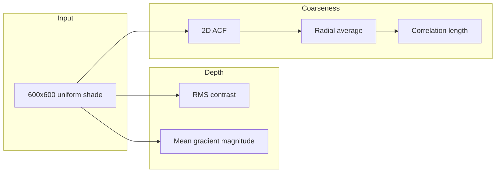

# Paper texture analysis — specification

**Status**: Implemented  
**Version**: 0.1.0

---

## Summary

Quantify paper "tooth" (depth/contrast) and coarseness (grain scale) from uniform shaded scans. Each input is a 600×600 px (or cropped) grayscale patch; the pipeline is translation-invariant and treats the patch as a single stationary sample.

---

## Inputs

| Input | Type | Description |
|-------|------|-------------|
| Image directory | Path | Directory containing one or more PNG images (e.g. shaded paper scans). |
| Patch size | Integer | Side length of square patch in pixels (default: 600). Each image is center-cropped to this size. |
| Image channel | — | First channel only (`[:, :, 0]`) for RGB images; single channel used as-is. |

---

## Outputs

| Output | Type | Description |
|--------|------|-------------|
| Summary table | CSV / ODS / stdout | One row per image: paper name (stem), `mean_intensity`, `rms_contrast`, `mean_gradient`, `correlation_length_px`, `acf_fwhm_px`, `power_scale_px`. |

---

## Metrics (requirements)

### Depth / tooth

- **Mean intensity**  
  - Definition: mean pixel value over the full patch (overall darkness/grayness; pairs with std).  
  - Implementation: `np.mean(patch)`.  
  - One scalar per image (typically 0–1 if image is 0–1).

- **RMS contrast**  
  - Definition: standard deviation of pixel intensity over the full patch.  
  - Implementation: `np.std(patch)`.  
  - One scalar per image.

- **Mean gradient magnitude**  
  - Definition: mean of the gradient magnitude over the patch.  
  - Implementation: `np.gradient(I)` for both axes, then `np.mean(np.hypot(gx, gy))`.  
  - One scalar per image.

### Coarseness

- **Correlation length ξ (pixels)**  
  - Definition: lag r at which the radially averaged ACF drops to 1/e.  
  - Implementation: 2D ACF → radial average → first r with ACF(r) ≤ 1/e (interpolated).  
  - One scalar per image.

- **ACF FWHM (pixels)**  
  - Definition: full width at half maximum of the radial ACF (diameter of central peak).  
  - Implementation: first r with ACF(r) ≤ 0.5 → FWHM = 2·r (interpolated).  
  - One scalar per image; coarser texture → wider peak.

- **Power scale (pixels)**  
  - Definition: characteristic scale from radial power spectrum: N / k_mean, where k_mean is the first moment of power over radial k (excluding DC).  
  - Implementation: FFT2 of demeaned patch → |FFT|² → radial bin → k_mean = Σ(k·P(k))/ΣP(k) → power_scale_px = N/k_mean.  
  - One scalar per image; finer grain → smaller power_scale_px.

### Optional (not implemented)

- **Variogram**: γ(Δ) = E[(I(x)−I(x+Δ))²] vs |Δ|; scale where γ levels off.

---

## Processing pipeline

1. **Load** — Discover all PNGs in the given directory; load each with a standard image reader; extract one channel; center-crop to patch size (e.g. 600×600).  
2. **Depth** — For each patch: compute RMS contrast and mean gradient magnitude.  
3. **Coarseness** — For each patch: compute 2D ACF, normalize, radial average, then correlation length ξ.  
4. **Export** — Emit a table (stdout and/or CSV/ODS): paper name (filename stem), `mean_intensity`, `rms_contrast`, `mean_gradient`, `correlation_length_px`, `acf_fwhm_px`, `power_scale_px`.

---

## CLI behavior

- **Command**: `paper-tooth-analysis` (entry point from `pyproject.toml`).  
- **Arguments**:  
  - Positional or `--input`: path to directory containing PNG images (default: current directory or a fixed default such as `papers/`).  
  - `--size`: patch size in pixels (default: 600).  
  - `--output`: optional path to write CSV; if omitted, print table to stdout.  
- **Exit**: 0 on success; non-zero on invalid arguments or I/O errors.

---

## Dependencies

- **numpy** — Arrays, gradient, std, hypot.  
- **scipy** — `scipy.signal.correlate` for 2D ACF; optionally `scipy.fft` for radial power spectrum.  
- **matplotlib** — Image loading (`matplotlib.pyplot.imread`) or equivalent; no plotting required for CLI.  
- **pandas** — Optional; for tidy summary DataFrame and CSV export. If omitted, use stdlib `csv` for CSV and formatted print for stdout.

---

## Data flow (diagram)

---

## References

- Plan: `.cursor/plans/paper_texture_analysis_measures_*.plan.md`  
- Legacy exploration: `Rauheit.ipynb` (FFT, ACF, wavelets).
