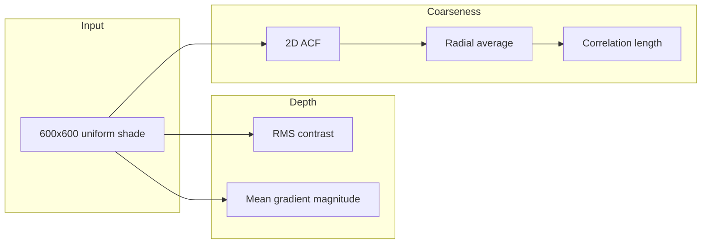

# Paper texture analysis — specification

**Status**: Implemented  
**Version**: 0.1.0

---

## Summary

Quantify paper "tooth" (depth/contrast) and coarseness (grain scale) from uniform shaded scans. Each input is a 600×600 px (or cropped) grayscale patch; the pipeline is translation-invariant and treats the patch as a single stationary sample.

---

## Inputs

| Input | Type | Description |
|-------|------|-------------|
| Image directory | Path | Directory containing one or more PNG images (e.g. shaded paper scans). |
| Patch size | Integer | Side length of square patch in pixels (default: 600). Each image is center-cropped to this size. |
| Image channel | — | First channel only (`[:, :, 0]`) for RGB images; single channel used as-is. |

---

## Outputs

| Output | Type | Description |
|--------|------|-------------|
| Summary table | CSV / stdout | One row per image: paper name (stem), `correlation_length_px`, `rms_contrast`, `mean_gradient`. Optional: `power_scale` if radial power spectrum is implemented. |

---

## Metrics (requirements)

### Depth / tooth

- **RMS contrast**  
  - Definition: standard deviation of pixel intensity over the full patch.  
  - Implementation: `I.ravel().std()` (or `np.std(I)`).  
  - One scalar per image.

- **Mean gradient magnitude**  
  - Definition: mean of the gradient magnitude over the patch.  
  - Implementation: `np.gradient(I)` for both axes, then `np.mean(np.hypot(gx, gy))`.  
  - One scalar per image.

### Coarseness

- **Correlation length ξ (pixels)**  
  - Definition: lag r at which the radially averaged autocorrelation function (ACF) drops to 1/e.  
  - Steps:  
    1. Compute 2D autocorrelation: correlate image with itself (e.g. `scipy.signal.correlate(I, I, mode='same')`).  
    2. Normalize so ACF(0) = 1 (divide by central value or by `correlate(ones, ones)`).  
    3. Radial average: from center `(cy, cx)`, bin by `r = sqrt((i-cy)^2 + (j-cx)^2)` (e.g. 1 px bins), average ACF in each bin.  
    4. Correlation length: first r for which `ACF(r) ≤ 1/e` (interpolate if needed).  
  - One scalar per image (in pixels).

### Optional (not required for v0.1)

- **Radial power spectrum**: radial average of |FFT|²; characteristic scale = 1/k_peak.  
- **Variogram**: γ(Δ) = E[(I(x)−I(x+Δ))²] vs |Δ|; scale where γ levels off.

---

## Processing pipeline

1. **Load** — Discover all PNGs in the given directory; load each with a standard image reader; extract one channel; center-crop to patch size (e.g. 600×600).  
2. **Depth** — For each patch: compute RMS contrast and mean gradient magnitude.  
3. **Coarseness** — For each patch: compute 2D ACF, normalize, radial average, then correlation length ξ.  
4. **Export** — Emit a table (stdout and/or CSV): paper name (filename stem), `correlation_length_px`, `rms_contrast`, `mean_gradient`.

---

## CLI behavior

- **Command**: `paper-tooth-analysis` (entry point from `pyproject.toml`).  
- **Arguments**:  
  - Positional or `--input`: path to directory containing PNG images (default: current directory or a fixed default such as `papers/`).  
  - `--size`: patch size in pixels (default: 600).  
  - `--output`: optional path to write CSV; if omitted, print table to stdout.  
- **Exit**: 0 on success; non-zero on invalid arguments or I/O errors.

---

## Dependencies

- **numpy** — Arrays, gradient, std, hypot.  
- **scipy** — `scipy.signal.correlate` for 2D ACF; optionally `scipy.fft` for radial power spectrum.  
- **matplotlib** — Image loading (`matplotlib.pyplot.imread`) or equivalent; no plotting required for CLI.  
- **pandas** — Optional; for tidy summary DataFrame and CSV export. If omitted, use stdlib `csv` for CSV and formatted print for stdout.

---

## Data flow (diagram)

---

## References

- Plan: `.cursor/plans/paper_texture_analysis_measures_*.plan.md`  
- Legacy exploration: `Rauheit.ipynb` (FFT, ACF, wavelets).
